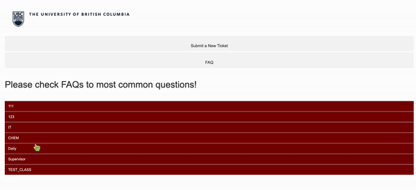

# TicketTamer: Tickets Management System

## Our project:
We collaborated with the UBC Chemistry Department, under the guidance of Mohamad and David, to create a specialized website that efficiently manages maintenance tickets within the department. This platform empowers regular users to submit maintenance requests effortlessly. It also allows staff members to collaboratively address and resolve these tickets. Additionally, the website features a supervisor mode, which provides tools for performance analysis and team management, ensuring a streamlined and effective maintenance process.




## PROBLEMS ON EXISTING SOLUTIONS:

**Email Oriented:** customers submit maintenance requests via  printed paper forms available in each shop. The tickets are manually generated and then manually distributed among four shops. Subsequently, each ticket is individually assigned to a maintenance staff member. Once the maintenance staff member completes the ticket, they are required to send an email to the customer to provide a status update and fill an excel form and submit the labor hours and parts costs.

This process is both time-consuming and inefficient. Moreover, it becomes particularly problematic when tickets cannot be resolved on the first attempt and need to be reassigned.

**Osticket, NinjaOne, etc:** 

1. While there are several popular online ticketing tools available, many cannot be customized to meet the specific requirements of the maintenance form used within the Chemistry Department.
2. None of these tools have the capability to generate financial reports that fulfill the requirements of the finance team.
3. None can provide summaries of costs according to a unique supervisor cross-speed chart.

## Our Design Solution:
Our platform, TicketTamer, revolutionizes the way maintenance requests are managed. The process begins when customers submit their maintenance tickets and print them directly at the office. Staff members can then easily claim these tickets. For cases requiring teamwork, staff can share tickets with colleagues, enhancing collaboration and overall efficiency. Beyond individual contributions, supervisors have the capability to monitor the performance of each staff member and the entire shop. They can also generate essential reports and invoices for the finance team. Additionally, supervisors can manage staff changes, seamlessly adding new members or removing former ones from the system.


## Server Environments Setup
This guide provides instructions for setting up and running the server application for our project. The server utilizes several technologies including Node.js, Express, and a SQLite database.

### Prerequisites

Before you begin, ensure you have Node.js installed on your machine. You can download and install Node.js from [https://nodejs.org/](https://nodejs.org/).

### Installation

1. **Clone the Repository**
   ```bash
   git clone git@github.com:Yitong999/UBCHEMTICKETS.git
   cd server 
   ```

2. **Install Dependencies** 
Navigate to the project directory and run the following command to install all necessary dependencies:
    ```bash
    npm install
    ```

3. **Environment Variables**
Create a .env file in the root directory of your project and add the necessary environment variables:
    ```
    SECRET_KEY=your_secret_key
    ```

4. **Running the Application**
To run the server in production mode, start it using:
    ```bash
    node server.js
    ```

## TODO: Demo feedback and future TODOs:

### User

1. ~~Submit the ticket, attach a file (can be png, jpg, word, pdf … )~~
2. Users are optional to put in a list of things they bring.

### Staff

1. ~~Fix adding part bug.~~
2. ~~Download the attached file~~
3. Add parts connect with full database (**or copy and paste from excel?**) - hold off
4. Make hours field separately from all shared working staff.
5. Split hours into billable **hours** and **non-billable hours**.
6. When reopen the ticket, a window is popped out for **New Ticket** or **Edit old ticket (in case mistakenly close the ticket).** If this is a new ticket, link to previous one in note, say like ‘it follows up with previous one…’)

### Supervisor:

1. In invoice part, separate total costs to parts costs and labor costs, and total. 
2. In general report part, separate total costs to parts costs and labor costs, and total. 
3. There are three level of privilege (Manager, Supervisor, and Staff). Supervisors can only see the closed tickets in his own shops, but manager can see all closed tickets. Also, supervisor can sign up for a staff, and manager can sign up for a manager, supervisor, and staff. Beyond it, IT department has the highest control. IT team can directly modify the database.

## Tickets System API Documentation

### POST: Submit Form
**URL:** `http://localhost:3000/form/submit`

**Sample Body:**
```json
{
    "customer_name": "TEST0",
    "office_num": "D315",
    "email": "TEST@mail.com",
    "phone_num": "1112223333",
    "speed_chart": "TEST",
    "supervisor_name": "TESTNAME",
    "service_type": "IT",
    "request_description": "TEST",
    "manufacturer": "lenovo"
}
```


### POST: Submit Form
**URL:** `http://localhost:3000/form/submit`

**Sample Body:**
```json
{
  "email": "tom@chem.ubc.ca",
  "password": "123456"
}
```

### GET: Logout
**URL:** `http://localhost:3000//logout`


### GET: Check If Generated Ticket ID Existing in Database Already
**URL:** `http://localhost:3000/ticket/checkId?id=`

**Sample Output:**
```json
{"id":"1","unique":true}
```
or
```json
{"id":"85714","unique":false}
```


### GET: Retrieve User Info
**URL:** `http://localhost:3000/user`

**Sample Output:**
```
{"email":"t@t","id":1,"name":"t","role":"staff"}
```

### GET: Retrieve all FAQs
**URL:** `http://localhost:3000/get-all-faqs`

**Sample Output:**
```json
[{"Q_id":1,"classification":"IT","question":"How to factory reset win10 OS?","solution":"To reset your PC, go to Start"},{"Q_id":2,"classification":"IT","question":"How to install linux ?","solution":"Windows Subsystem for Linux (WSL), Bare metal Linux; or create a Virtual Machine (VM) to run Linux locally or in the cloud."},{"Q_id":3,"classification":"CHEM","question":"How to install linux ?","solution":"Windows Subsystem for Linux (WSL), Bare metal Linux; or create a Virtual Machine (VM) to run Linux locally or in the cloud."},{"Q_id":4,"classification":"CHEM","question":"How to install win10 ?","solution":"Windows Subsystem for Linux (WSL), Bare metal Linux; or create a Virtual Machine (VM) to run Linux locally or in the cloud."},{"Q_id":5,"classification":"Daily","question":"How to test?","solution":"Eat breakfast"},{"Q_id":6,"classification":"Daily","question":"How to use folk?","solution":"Wash hand"},{"Q_id":7,"classification":"Supervisor","question":"DSDFDF?","solution":"This is from supervisor."},{"Q_id":8,"classification":"TEST_CLASS","question":"today's date","solution":"Feb 9th."},{"Q_id":9,"classification":"123","question":"123","solution":"123"},{"Q_id":10,"classification":"111","question":"1","solution":"1"},{"Q_id":11,"classification":"111","question":"2","solution":"2"},{"Q_id":12,"classification":"111","question":"3","solution":"3"},{"Q_id":13,"classification":"IT","question":"1","solution":"1"}]
```


### POST: Add a FAQ to FAQ List
**URL:** `http://localhost:3000/add-faq`

**Sample Body:**
```json
{
    "classification": "CHEM",
    "question": "How to install win10 ?",
    "solution": "Windows Subsystem for Linux (WSL), Bare metal Linux; or create a Virtual Machine (VM) to run Linux locally or in the cloud."
}
```


### GET: Retrieve All Opening Tickets
**URL:** `http://localhost:3000/tickets/all_open`

**Sample Output:**
```json
[{"id":85712,"customer_name":"TEST0","office_num":"D315","email":"TEST@mail.com","phone_num":"1112223333","speed_chart":"TEST","supervisor_name":"TESTNAME","service_type":"TEST","request_description":"TEST","manufacturer":"lenovo","status":"open","open_time":1713383059110,"close_time":0,"note":null,"staff":null,"pickup_time":0,"time":0,"chat":null}, ...]
```


### GET: Retrive All Open Tickets within the Shop @shop_name
**URL:** `http://localhost:3000/tickets/shop/:shop_name`

**Sample Output:**
```json
[{"id":85714,"customer_name":"TEST0","office_num":"D315","email":"TEST@mail.com","phone_num":"1112223333","speed_chart":"TEST","supervisor_name":"TESTNAME","service_type":"it","request_description":"TEST","manufacturer":"lenovo","status":"open","open_time":1713386998242,"close_time":0,"note":null,"staff":null,"pickup_time":0,"time":0,"chat":null}, ...]
```

## POST: Download an ticket's attached file
**URL:** `http://localhost:3000/download`
**Sample Body:**
```json
{
    "file_name": "uploads/login.gif"
}
```

## POST: Staff @id pick up an ticket with @ticket_id
**URL:** `http://localhost:3000/pickup/:id/:ticket_id`


### POST: Staff @id save the change toward the ticket with @ticket_id
**URL:** `http://localhost:3000/save/:id/:ticket_id`
**Sample Body:**
```json
{
    "note": "I am processing the ticket."
}
```


### POST: Reassign ticket @ticket_id to staff @id
**URL:** `http://localhost:3000/reassign/:id/:ticket_id`


### POST: Staff finishes the ticket with @ticket_id
**URL:** `http://localhost:3000/complete/:ticket_id`
**Sample Body:**
```json
{
    "note": "The ticket is done"
}
```

### POST: Reopen a closed ticket
**URL:** `http://localhost:3000/reopen/:ticket_id`

### GET: Retrieve the Ticket Chat
**URL:** `http://localhost:3000/tickets/chat/:ticket_id`

**Sample Body:**
```json
{"chat":"T is editing this. (from t 4/12/2024, 10:03:40 AM) (from t 4/12/2024, 10:04:20 AM)\nT1 edit. (from t1 4/12/2024, 10:06:54 AM) (from t 4/12/2024, 10:08:07 AM)"}
```

### PUT: Update the Ticket Chat
**URL:** `http://localhost:3000/tickets/chat/update/:ticket_id`

**Sample Body:**
```json
{
    "chat": "hello world"
}
```


### PUT: Update the Ticket General Info
**URL:** `http://localhost:3000/form/change/:id`

**Sample Body:**
```json
{
    "customer_name": "Marry",
    "office_num": "test",
    "email": "marry@mail.com",
    "phone_num": "",
    "speed_chart": "TEST",
    "supervisor_name": "TESTNAME",
    "service_type": "it",
    "request_description": "TEST",
    "manufacturer": "lenovo"
}
```

### POST: Process the Ticket, add hours, rate, parts and costs, research_or_teach, and type
**URL:** `http://localhost:3000/process_ticket`

**Sample Body:**
```json
{
    "hours": 2,
    "rate": 20,
    "parts_and_costs": "[]",
    "research_or_teach": "research",
    "type": "Maintenance",
}
```


### GET: Retrieve Info of Processed Ticket such as hours, rate, parts and costs, research_or_teach, and type
**URL:** `http://localhost:3000/get_processed_ticket/:id`

**Sample Output:**
```json
{"id":13263,"hours":5,"rate":20,"parts_and_costs":"[{\"part\":\"part 2\",\"partQuantity\":20,\"partPrice\":5},{\"part\":\"part 1\",\"partQuantity\":5,\"partPrice\":20}]","research_or_teach":"teaching","type":"new equipment","client_type":"ubc-chem"}
```

### PUT: Update a Processed Ticket
**URL:** `http://localhost:3000/process_ticket/:id`

**Sample Body:**
```json
{
    "hours": 2,
    "rate": 20,
    "parts_and_costs": "[{\"part\":\"part 2\",\"partQuantity\":20,\"partPrice\":5},{\"part\":\"part 1\",\"partQuantity\":5,\"partPrice\":20}]",
    "research_or_teach": "research",
    "type": "Maintenance",
}
```

### GET: Retrieve All Inprogress Tickets
**URL:** `http://localhost:3000/tickets/inprogress/`

**Sample Body:**
```json
[{"id":71814,"customer_name":"1","office_num":"1","email":"1","phone_num":"1","speed_chart":"1","supervisor_name":"1","service_type":"glass","request_description":"1","manufacturer":"","status":"inprogress","open_time":1712946705142,"close_time":0,"note":null,"staff":"[\"1\"]","pickup_time":1712946715074,"time":0,"chat":null},{"id":85711,"customer_name":"Yitong Tang","office_num":"D315","email":"nb.yitong@gmail.com","phone_num":"(587) 372-1883","speed_chart":"mhmd","supervisor_name":"Mohamad","service_type":"it","request_description":"test","manufacturer":"","status":"inprogress","open_time":1712941983920,"close_time":0,"note":null,"staff":"[\"1\",\"2\"]","pickup_time":1712942007720,"time":0,"chat":" (from t 4/12/2024, 10:37:14 AM)"}]
```

### GET: Retrieve All Completed Tickets
**URL:** `http://localhost:3000/tickets/completed/`

**Sample Body:**
```json
[{"id":13263,"customer_name":"Yitong Tang","office_num":"D315","email":"nb.yitong@gmail.com","phone_num":"(587) 372-1883","speed_chart":"mhmd","supervisor_name":"Mohamad","service_type":"it","request_description":"This is a testing ticket.","manufacturer":"Sony","status":"complete","open_time":1712941063786,"close_time":1712941688471,"note":"The ticket is done.","staff":"[\"1\",\"2\"]","pickup_time":1712941322462,"time":0,"chat":"T is editing this. (from t 4/12/2024, 10:03:40 AM) (from t 4/12/2024, 10:04:20 AM)\nT1 edit. (from t1 4/12/2024, 10:06:54 AM) (from t 4/12/2024, 10:08:07 AM)"},{"id":31153,"customer_name":"Yitong Tang","office_num":"","email":"nb.yitong@gmail.com","phone_num":"(587) 372-1883","speed_chart":"mhmd","supervisor_name":"Mohamad","service_type":"it","request_description":"test 3","manufacturer":"","status":"complete","open_time":1712943864997,"close_time":1712945562053,"note":"The ticket is done","staff":"[\"1\",\"2\"]","pickup_time":1712945401241,"time":0,"chat":"You haven't leave any message (from t 4/12/2024, 11:11:05 AM) (from t 4/12/2024, 11:12:02 AM) (from t 4/12/2024, 11:12:41 AM)"}]
```


### GET: Retrieve All Staff's Info from Database
**URL:** `http://localhost:3000/staff/all`

**Sample Output:**
```json
[{"id":1,"name":"t","email":"t@t","role":"staff","shop":"IT","password":"$2b$10$d5BaXhg5QHKFxTnGXqbXG.KS/QZo64Ou3A7zs47bJiTSlhbiMYjGu","in_progress_tickets":"[{\"pickup_time\":1712946715074,\"ticket_id\":\"71814\"},{\"pickup_time\":1712942007720,\"ticket_id\":\"85711\"}]","completed_tickets":"[{\"pickup_time\":1712941322462,\"complete_time\":1712941688469,\"ticket_id\":\"13263\"},{\"pickup_time\":1712945401241,\"complete_time\":1712945562049,\"ticket_id\":\"31153\"}]","status":1},{"id":2,"name":"t1","email":"t1@t","role":"supervisor","shop":"IT","password":"$2b$10$5ejpxXDGD3NLoWblrLLP8.7J7Am7zf0IJHgufabXHF2ewcX.UrBwq","in_progress_tickets":"[{\"pickup_time\":1712942007720,\"ticket_id\":\"85711\"}]","completed_tickets":"[{\"pickup_time\":1712941322462,\"complete_time\":1712941688469,\"ticket_id\":\"13263\"},{\"pickup_time\":1712945401241,\"complete_time\":1712945562049,\"ticket_id\":\"31153\"}]","status":1},{"id":3,"name":"new","email":"n@n","role":"staff","shop":"Chemistry","password":"$2b$10$HU2eoCQKJwIsnGjn.QbZA.hJ/OtDEuj5bDnEMqTFKZtwolsPE5mb6","in_progress_tickets":"[]","completed_tickets":"[]","status":0}]
```

### GET: Retrieve All Inprogress Tickets under Staff @id, with no limitation of time or any other conditions
**URL:** `http://localhost:3000/tickets/myinprogress/:id`

**Sample Output:**
```json
{"in_progress_tickets":"[{\"pickup_time\":1712946715074,\"ticket_id\":\"71814\"},{\"pickup_time\":1712942007720,\"ticket_id\":\"85711\"}]"}
```


### GET: Track staff @id 's completed tickets within a time range
**URL:** `http://localhost:3000/completed/staff/:id`

**Sample Output:**
```json
{"completed_tickets":"[{\"pickup_time\":1712941322462,\"complete_time\":1712941688469,\"ticket_id\":\"13263\"},{\"pickup_time\":1712945401241,\"complete_time\":1712945562049,\"ticket_id\":\"31153\"}]"}
```


### GET: Retrieve All Completed Tickets under Staff @id, with no limitation of time or any other conditions
**URL:** `http://localhost:3000/tickets/mycompleted/:id`

**Sample Output:**
```json
{"completed_tickets":"[{\"pickup_time\":1712941322462,\"complete_time\":1712941688469,\"ticket_id\":\"13263\"},{\"pickup_time\":1712945401241,\"complete_time\":1712945562049,\"ticket_id\":\"31153\"}]"}
```


### GET: Retrieve All Tickets Submitted by Customer @name
**URL:** `http://localhost:3000/form/retrieve/name/:name`

**Sample Output:**
```json
[{"id":85712,"customer_name":"TEST0","office_num":"D315","email":"TEST@mail.com","phone_num":"1112223333","speed_chart":"TEST","supervisor_name":"TESTNAME","service_type":"TEST","request_description":"TEST","manufacturer":"lenovo","status":"open","open_time":1713383059110,"close_time":0,"note":null,"staff":null,"pickup_time":0,"time":0,"chat":null},{"id":85713,"customer_name":"TEST0","office_num":"D315","email":"TEST@mail.com","phone_num":"1112223333","speed_chart":"TEST","supervisor_name":"TESTNAME","service_type":"IT","request_description":"TEST","manufacturer":"lenovo","status":"open","open_time":1713386984870,"close_time":0,"note":null,"staff":null,"pickup_time":0,"time":0,"chat":null},{"id":85714,"customer_name":"TEST0","office_num":"D315","email":"TEST@mail.com","phone_num":"1112223333","speed_chart":"TEST","supervisor_name":"TESTNAME","service_type":"it","request_description":"TEST","manufacturer":"lenovo","status":"open","open_time":1713386998242,"close_time":0,"note":null,"staff":null,"pickup_time":0,"time":0,"chat":null}]
```

### GET: Retrieve All the Tickets under a specific service_type, start_time, and end_time
**URL:** `http://localhost:3000/requests/condition`

**Sample Body::**
```json
{
    "service_type": "it", 
    "start_time": 1712941322462, 
    "end_time": 1812941322462

}
```

### GET: Retrieve the General Report of All the Ticket
**URL:** `http://localhost:3000/request/general_report/`

**Sample Output::**
```json
{"message":"success","data":[{"id":13263,"status":"complete","supervisor_name":"Mohamad","speed_chart":"mhmd","service_type":"it","staff":"[\"1\",\"2\"]","note":"The ticket is done.","price":300},{"id":31153,"status":"complete","supervisor_name":"Mohamad","speed_chart":"mhmd","service_type":"it","staff":"[\"1\",\"2\"]","note":"The ticket is done","price":300},{"id":71814,"status":"inprogress","supervisor_name":"1","speed_chart":"1","service_type":"glass","staff":"[\"1\"]","note":null,"price":0},{"id":85711,"status":"inprogress","supervisor_name":"Mohamad","speed_chart":"mhmd","service_type":"it","staff":"[\"1\",\"2\"]","note":null,"price":800}]}
```


### GET: Retrieve the Invoice of the Ticket @ticket_id
**URL:** `http://localhost:3000/request/invoice/:ticket_id`

**Sample Output::**
```json
{"ticket":{"id":31153,"service_type":"it","supervisor_name":"Mohamad","speed_chart":"mhmd","hours":20,"rate":5,"parts_and_costs":"[{\"part\":\"part 2\",\"partQuantity\":10,\"partPrice\":20}]"}}
```